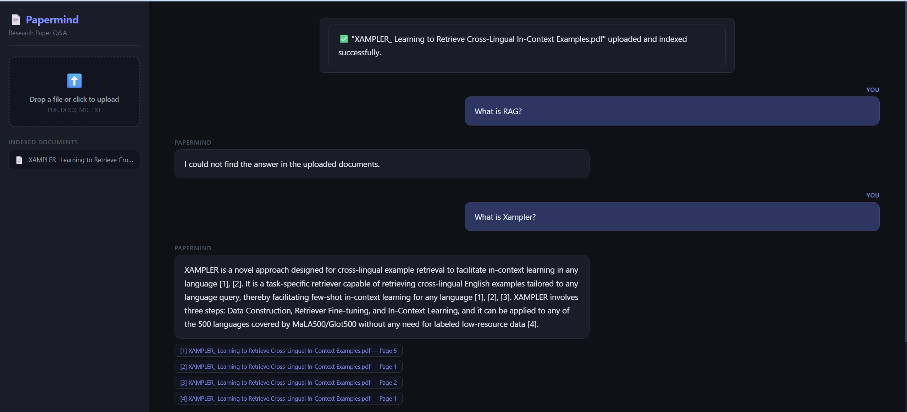

# Papermind — RAG System for Research Papers

A production-grade Retrieval-Augmented Generation (RAG) system built for researchers and students who need to query collections of academic papers. Upload your reading list, ask questions, and get answers with inline citations pointing to exact pages and source documents.

Built by Ahmad Hassan — Master's student in AI & NLP at Harbin Institute of Technology, Shenzhen. Developed as a real tool for my own thesis research on Urdu reasoning benchmarks (URBench).

## 🔗 Live Demo
**[https://papermind-5fen.onrender.com](https://papermind-5fen.onrender.com)**

---

## Problem Statement

Researchers working with large collections of papers face a real problem: finding specific information across dozens of PDFs is slow, keyword search misses context, and generic RAG systems hallucinate or return irrelevant chunks. Most portfolio RAG projects are tutorial-level — they work on one PDF with basic semantic search and no way to verify quality.

Papermind solves this with a multi-stage retrieval pipeline that combines keyword and semantic search, reranks results, and returns answers with page-level citations you can verify.

---

## Features

- Upload PDF, DOCX, MD, or TXT documents
- Hybrid retrieval — BM25 keyword search + dense vector similarity, fused via Reciprocal Rank Fusion
- Reranking — retrieves 20 candidates, reranks to top 5 before LLM call using Jina reranker API
- Inline citations — every answer references exact source document and page number
- Multi-document support — query across an entire corpus, not just one file
- Fast LLM answers via Groq (LLaMA 3.3 70B)
- React frontend — professional UI with document library and chat interface
- Fully Dockerized — single command deployment
- Deployed on Render — live and accessible from anywhere

---

## Architecture

User Query

│

▼

Hybrid Retrieval

├── BM25 (keyword)      ─┐

└── Dense (semantic)    ─┴─► Reciprocal Rank Fusion → 20 candidates

│

▼

Jina Reranker API (jina-reranker-v2-base-multilingual)

│ top 5 chunks

▼

Groq LLM (LLaMA 3.3 70B)

│

▼

Answer + Inline Citations [1] [2] [3]

---

## Tech Stack

| Layer | Technology |
|---|---|
| API | FastAPI + Uvicorn |
| Frontend | React + Vite (served from FastAPI) |
| Vector Store | ChromaDB 0.5.23 |
| Embeddings | Jina AI API (jina-embeddings-v3) |
| Keyword Search | BM25 (rank-bm25) |
| Reranker | Jina AI API (jina-reranker-v2-base-multilingual) |
| LLM | Groq — LLaMA 3.3 70B |
| Document Parsing | PyPDF + LangChain + python-docx |
| Containerization | Docker + docker-compose |
| Deployment | Render (free tier) |

---

## Project Structure
papermind/

├── app/

│   ├── core/           # Configuration and environment variables

│   ├── models/         # Pydantic request/response schemas

│   ├── routes/         # API endpoints (health, upload, query, documents)

│   ├── services/

│   │   ├── ingest_service.py           # Document loading, chunking, Jina embeddings

│   │   ├── hybrid_retrieval_service.py # BM25 + dense + RRF fusion

│   │   ├── rerank_service.py           # Jina reranker API

│   │   └── rag_service.py              # Groq LLM answer generation

│   └── utils/          # File handling helpers

├── frontend-react/     # React + Vite frontend

│   └── dist/           # Built static files served by FastAPI

├── data/

│   ├── uploads/        # Uploaded documents

│   └── chroma_db/      # Persisted vector store

├── screenshots/        # Demo screenshots

├── Dockerfile          # Multi-stage build (Node + Python)

├── docker-compose.yml

└── requirements.txt

---

## Quick Start

### Live Version
Visit **[https://papermind-5fen.onrender.com](https://papermind-5fen.onrender.com)** directly — no setup needed.
Note: free tier spins down after inactivity, first request may take 30-60 seconds.

### Run Locally

```bash
git clone https://github.com/ahmadhassan22/papermind.git
cd papermind
cp .env.example .env
# Add your GROQ_API_KEY and JINA_API_KEY to .env
pip install -r requirements.txt
python run.py
```

### With Docker

```bash
git clone https://github.com/ahmadhassan22/papermind.git
cd papermind
cp .env.example .env
# Add your GROQ_API_KEY and JINA_API_KEY to .env
docker compose up --build
```

API at `http://localhost:8000` | Swagger UI at `http://localhost:8000/docs`

---

## Environment Variables
GROQ_API_KEY=your_groq_api_key
JINA_API_KEY=your_jina_api_key

Get free keys at [console.groq.com](https://console.groq.com) and [jina.ai](https://jina.ai).

---

## API Endpoints

| Method | Endpoint | Description |
|---|---|---|
| GET | `/` | Serves React frontend |
| GET | `/health` | Service status |
| POST | `/upload` | Upload and index a document |
| POST | `/query` | Query indexed documents |
| GET | `/documents` | List indexed documents |

---

## Engineering Decisions

**Why Jina AI for embeddings and reranking instead of local models?**
Local embedding models (sentence-transformers) require 400MB+ RAM just for the model weights, pushing the total app memory over 512MB and causing OOM crashes on free-tier hosting. Jina AI's API provides state-of-the-art embeddings and reranking with zero local memory footprint — all computation runs on their servers. Free tier includes 1M tokens/month, sufficient for portfolio and personal research use.

**Why hybrid retrieval instead of pure semantic search?**
Research papers contain technical terms, model names, and acronyms (e.g., "BLEU", "MaLA500", "SIB200") that semantic search can miss. BM25 catches exact keyword matches while dense vectors handle meaning. Reciprocal Rank Fusion combines both ranked lists without requiring score normalization.

**Why reranking after retrieval?**
Bi-encoders (used for initial retrieval) encode query and document independently — fast but less accurate. A reranker scores query-document pairs together for much better relevance judgment. We retrieve 20 candidates cheaply, then rerank to top 5 accurately, improving answer quality while reducing LLM context size.

**Why Groq instead of local Ollama?**
Ollama requires 4GB+ local model download and CPU inference is slow. Groq's free tier provides 30 req/min at ~500 tokens/sec — fast enough for real use, zero infrastructure cost.

**Why chunk_size=1000 with overlap=200?**
Research paper paragraphs average 600–900 characters. Smaller chunks split sentences mid-way, breaking context. 1000 characters preserves paragraph integrity; 200-character overlap ensures context isn't lost at boundaries.

**Why serve React from FastAPI instead of separate hosting?**
Single deployment, single URL, no CORS issues between frontend and backend. The React app is built at Docker image build time and served as static files from FastAPI — one `docker compose up` runs the entire stack.

---

## Screenshots




---

## Author

**Ahmad Hassan**
Master's Student — AI & NLP, Harbin Institute of Technology Shenzhen
[GitHub](https://github.com/ahmadhassan22) | [LinkedIn](https://linkedin.com/in/ahmadhassan22)